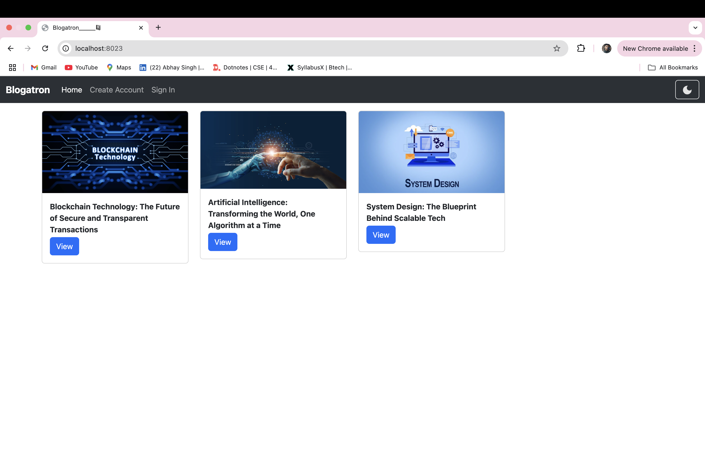
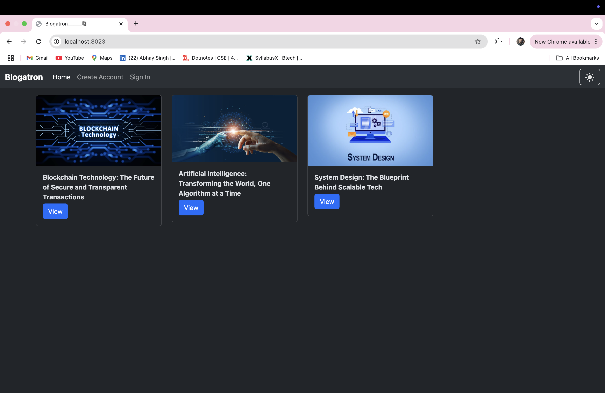
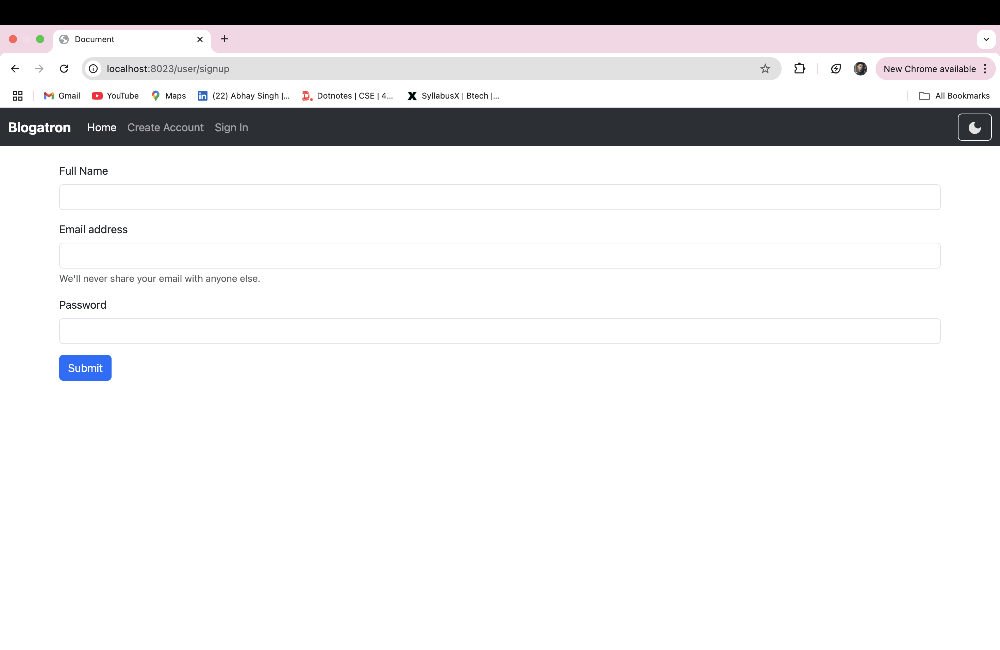
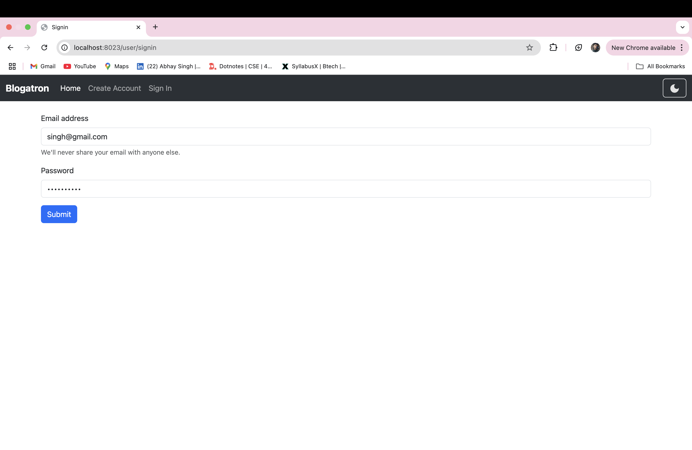
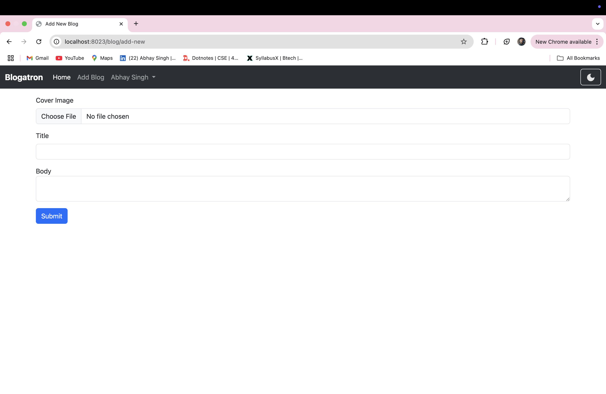

# Blogatron 📝

**Blogatron** is a dynamic and modern blogging web application that allows users to read, write, and comment on blog posts. It features user authentication and a responsive UI with a theme toggle for light and dark modes.

--- 

## 🚀 Features

- 📖 **Read Blogs**: Anyone can browse and read published blogs.
- ✍️ **Write Blogs**: Only registered users can write and publish new blogs.
- 💬 **Comment**: Authenticated users can comment on blog posts.
- 🔐 **Authentication**: Secure Sign Up and Sign In using JSON Web Tokens (JWT).
- 🎨 **Theme Toggle**: Switch between light and dark mode from the top-right navbar.

---

## 🛠️ Tech Stack

- **Frontend**: HTML, EJS (Embedded JavaScript Templates), Bootstrap
- **Backend**: Node.js, Express.js
- **Database**: MongoDB with Mongoose ODM
- **Authentication**: JWT (JSON Web Tokens)
- **Environment Config**: dotenv
- **File Upload**: multer
- **Session and Cookie Management**: cookie-parser

---

## 📂 Folder Structure


    ├── middlewares
    ├── models
    ├── node_modules
    ├── public
    ├── routes
    ├── services
    ├── views
    │ ├── partials
    │ ├── addBlog.ejs
    │ ├── blog.ejs
    │ ├── home.ejs
    │ ├── signin.ejs
    │ └── signup.ejs
    ├── .env
    ├── app.js
    ├── package.json

---

## 🔧 Installation

1. Clone the repository:
   ```bash
   git clone https://github.com/yourusername/blogatron.git
   cd blogatron

2. Install dependencies
    ```bash 
    npm install

3. Create a .env file and set the following variables:
    ```ini
    PORT=yourPORT
    MONGODB_URI=your_mongodb_connection_string
    JWT_SECRET=your_secret_key

4. Run the app:
    - Development: npm run dev
    - Production: npm start
    - Visit: http://localhost:yourPORT

---

## 📸 Screenshots

Home page (with blogs)


Dark mode view


Sign In / Sign Up



Home page (after Signup)


Blog post page


---

## ✍️ Author
Created by Abhay Singh

---

## 📄 License
This project is licensed under the ISC License.


